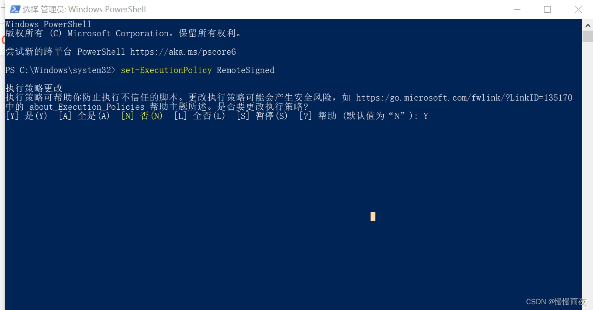

# pnpm

## OverView

安装

```
npm i -g pnpm
```

设置镜像源

```bash
pnpm config set registry https://registry.npm.taobao.org/

# 检查
pnpm config get registry
```

上面镜像可能有问题，换下面的

```
npm config set registry https://registry.npmmirror.com

```


## ERROR

### 禁止运行问题

```
pnpm : 无法加载文件 D:\vue\nodejs\pnpm.ps1，因为在此系统上禁止运行脚本。有关详细信息，请参阅 https:/go.microsoft
.com/fwlink/?LinkID=135170 中的 about_Execution_Policies。
所在位置 行:1 字符: 1
+ pnpm create vite
+ ~~~~
    + CategoryInfo          : SecurityError: (:) []，PSSecurityException
    + FullyQualifiedErrorId : UnauthorizedAccess
```

**解决办法：**

以管理员身份运行 **Windows PowerShell** ，

在命令行输入以下命令后按回车，

```csharp
set-ExecutionPolicy RemoteSigned
```

再输入Y 回车即可。



### Node.js version

```
ERROR: This version of pnpm requires at least Node.js v18.12
The current version of Node.js is v16.18.1
Visit https://r.pnpm.io/comp to see the list of past pnpm versions with respective Node.js version support.
```

node版本对不上，安装新版本的node

第一步，先查看本机[node.js](https://so.csdn.net/so/search?q=node.js&spm=1001.2101.3001.7020)版本：

```
node -v
```

第二步，清除node.js的cache：

```
sudo npm cache clean -f
```

查看自己已经安装的node版本

```
nvm list
```

切换node版本

```
nvm use 版本号     nvm use 18.12.1
```

安装node

```
npm install 版本号
```

可以安装啥版本

```
nvm list available
```


### 识别不了pnpm

```
npm : 无法将“pnpm”项识别为 cmdlet、函数、脚本文件或可运行程序的名称。请检查名称的拼写，如果包括路径，请确保路
径正确，然后再试一次。
所在位置 行:1 字符: 1
+ pnpm
+ ~~~~
    + CategoryInfo          : ObjectNotFound: (pnpm:String) [], CommandNotFoundException
    + FullyQualifiedErrorId : CommandNotFoundException
```

切换了node版本，pnpm也要重新安装


## pnpm和npm

pnpm和npm是两个不同的包管理工具

NPM（Node Package Manager）是Node.js的官方[包管理工具](https://so.csdn.net/so/search?q=包管理工具&spm=1001.2101.3001.7020)，用于安装、发布和管理Node.js模块。NPM将包安装在项目的node_modules目录中，每个包都有自己的依赖树。

PNPM（Plug’n’Play Package Manager）是一个新的包管理工具，也是NPM的另一个替代方案。与NPM不同，PNPM使用符号链接（symlink）而不是复制文件来安装包。这意味着所有的包都被安装在一个共享的存储库中，并且可以在不同的项目之间共享。这样可以显著减少磁盘使用量，并加快安装和更新过程。
