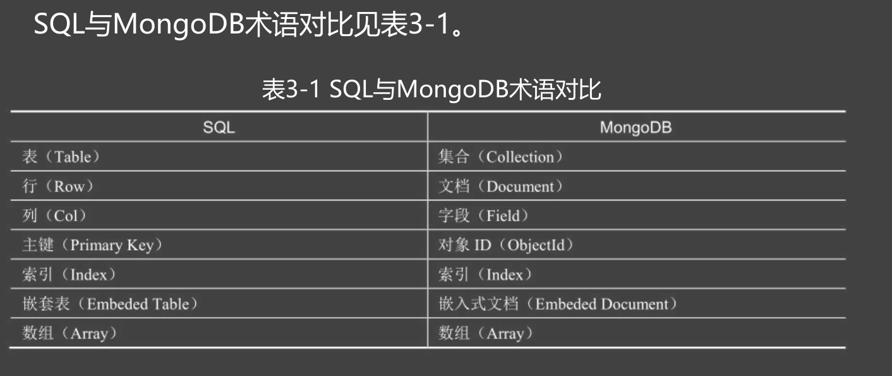

# MongoDB
## 适合场景
* 适合存储大量关联性不强的数据
* mongoDB中的数据以“库” ---“集合” ---“文档” --- “字段“结构进行存储
* 不需要预先定义表结构，数据的字段可以随意需改，并发速度远远超过传统的关系型数据库
![[Pasted image 20240319234753.png]]

## 下载安装

https://www.mongodb.com/try/download/community-kubernetes-operator

